## Rule of Thumb - React + Next.js

### Resumen

Esta es una aplicación que le permite al usuario compartir sus opiniones o puntos de vista usando un sistema votación, a su vez el recibirá feedback de los resultados mientras las encuestas sigan vigentes. Landing page Full Responsive + Design specifications.

La app se encuentra en este link: https://rule-of-thumb-app.vercel.app/

### Para usar la app en modo de desarrollo:

- Usar node `v14.15.4` LTS
- Navegadores Basados en Chromium (+79) o Safari
- Instalar dependencias con `yarn` o `npm`
- Ejecutar script de servidor local con `yarn dev/npm dev`, e ingresar a: `http://localhost:3000/`
  **Nota** Si tienes SO Linux con Fedora o OpenSuse ejecuta el script con el comando `HOST={Ip de tu subred} yarn dev/npm run dev`

### Dependencias

- **React Js** Uso de la API de la versión v17 con Hooks como: useState,useReducer,useEffect, useContext.
- **Next Js** Proporciona muchos beneficios para trabajar desde el lado del servidor ejecutando tareas de _renderizado_ desde el _runtime_ del navegador con Javascript.
- **Tailwind** Framework de CSS que permite trabajar lading pages muy rápido gracias a su tipografía intuitiva y sencilla.
- **Swiper.js** Utilidad para que permite crear swippers tipo galería de forma sencilla y con alto performance para React Js.
- **react-sizeme** Utilidad para facilitar validaciones de media queries por medio de los _props_ de forma practica con JSX. **Nota**: El uso cuenta cuando los componentes requieren de dinamismo con sus estilos y validaciones que se alcanzan a realizar con css-in-js o tailwind.

### Implementación

- **WorkSpace** El proyecto se separa en varias carpetas, de forma que los componentes quedan en un lugar, la configuración de context, configuración reflux, etc, estilos etc.

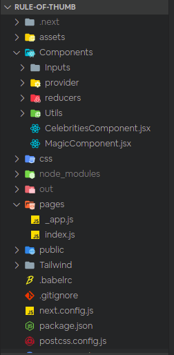

- **Home de Página** Aprovechando el sistema de rutas que trae `Next.js`, se codificó el path `/` como componente de React. Se normalizaron todos los warnings, se cambiaron etiquetas para optimizar el `Build`, se hicieron los cambios necesarios para compilar bien el proyecto.

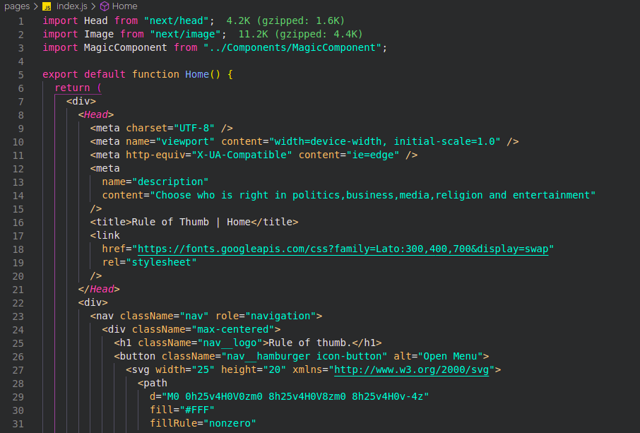

- **Componente Mágico** Se crea un nuevo componente llamado `MagicComponent` el cuál contiene la lógica del reto del proyecto.

- **Contexto para manejar estados** Usando la API de Context ofrecida por react se crea un contexto global para almacenar estados complejos comprendidos por el hook useReducer.

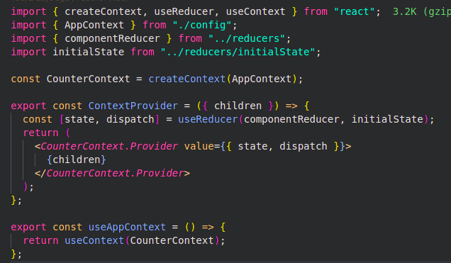

- **Gestion de almacenamiento de estados** con useRedicer, Se desarrolló un proceso bajo la premisa de crear una estructura muy parecida a Reflux inspirada en Redux para almacenar los estados, comprendidos en: (1) disparador: ejecuta una accion para guardar un estado, (2) reducer: almacena el estado, (3) context: dispone el estado para usarlo en toda la aplicación.

**1. Disparador**

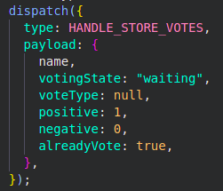

**2. Reducer**

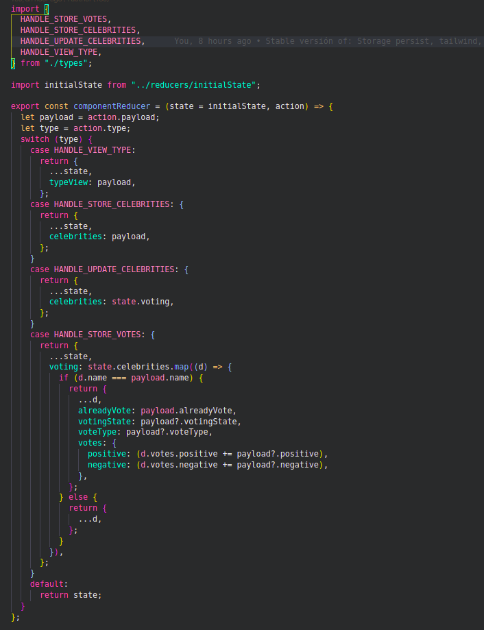

**3. Context**

- **Funciones de Utilidad** En la carpeta de utils se aloján los métodos propuestos para realizar un tratamiento de datos para devolver un valor, teniendo en cuenta que no se van a devolver elementos para renderizar (JSX).

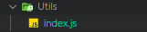

- **Componente de Celebridades** El componente `CelebritiesComponent` contiene la logica para pintar a las celebridades, uso de la data y media queries. Se usaron dependendecias de React Hooks, Vanilla Js ES6 - ES21, tailwind css, css-in-js, librearía para mostrar carrousel de personas, etc.

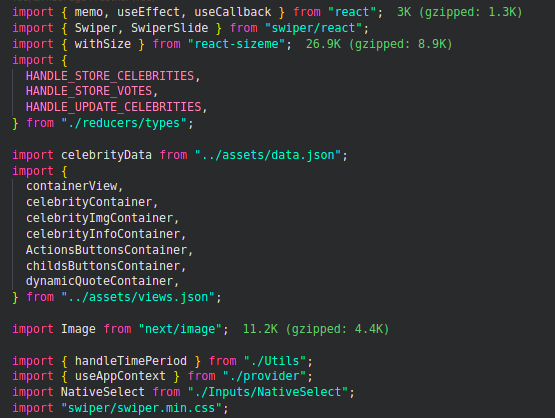

### Tratamiento de los Datos

- **Al cargar la página** En el método `handleGetCelebrities` se captura los datos de `data.json` y se almacenan en el estado global de context API, tambien se tiene en consieración si ya han realizado votaciones que se guardaron el LocalStorage API para cargarlas y se muestre data de forma persistente

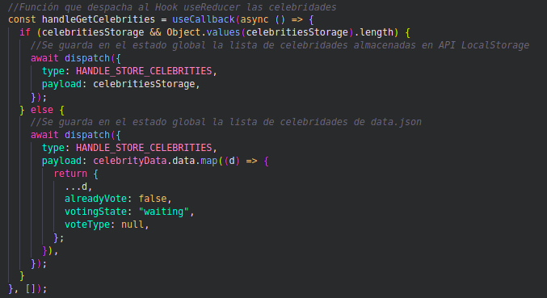

- **Al realizar votos** El método `handleUpdateCelebrities` se encarga de disparar actualizaciones de los estados según los votos que se vatan realizando, de tal forma que se asegura de actualizar propiedades de los objetos que vayan cambiando

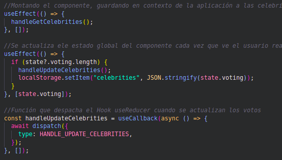

- **Al votar** `handleVoteAction` se encarga de pintar el botón de votación o de votar nuevamente.

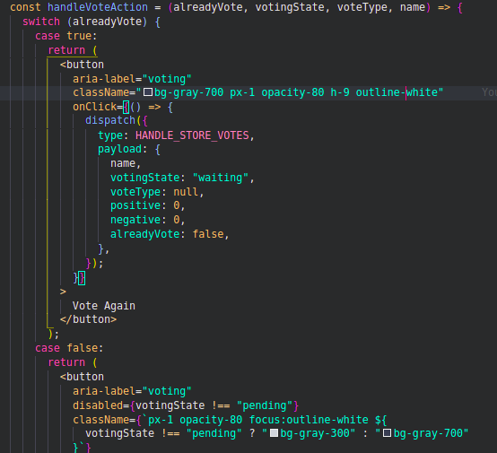

- **Al ver fecha o estado de votación** `handlePollDateQuote` sirve para pintar el eyebrow text de votación o la fecha de gestión del participante en los votos.

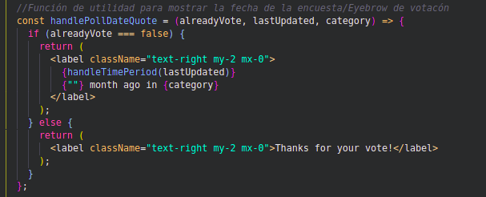

- **Al mapear las celebridades** Para renderizar cada una de las celebridades y su sistema de votos, se tuvo en cuenta un desarrollo modular para: calcular porcentajes, asignar propiedades de utilidad, estilos dinámicos, performance del componente y actualizaciones dinamicas del componente.

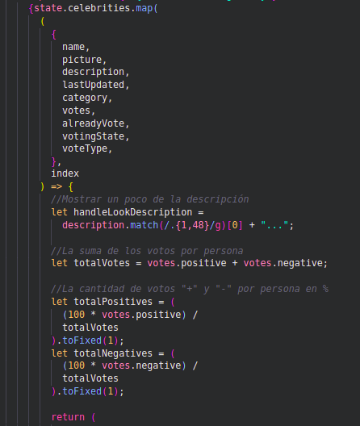

- **Visualización de Grid o de Listas** Para ello se pensó en un esquema de acceso a datos orientado a `data-driven`, donde se tiene una predisposición de valores con estilo para solo preocuparse por indicar en el código donde se utiliza el mismo.

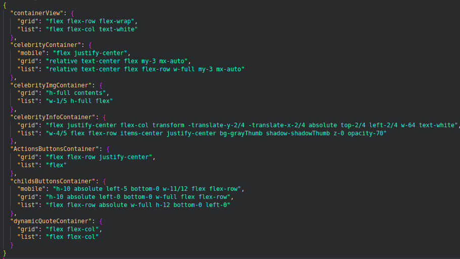

### Beyond UI Development

- **Google Lighthouse** Buen indexamiento SEO, performance y accesbilidad.seo
  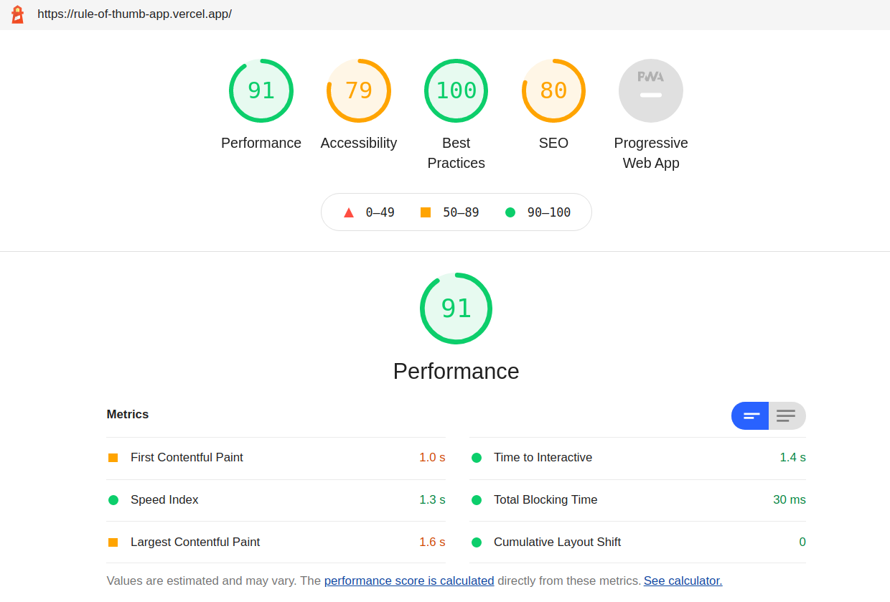

- **Git Workflow** Las `Líneas Verdes` son el setup del Proyecto e instalación de las librerías a utilizar, `Líneas Amarillas` el proceso de codificación y refactorización de algunas partes del código, `Líneas Azules` la disposicion y arreglo de hotfix para entrega de la prueba.
  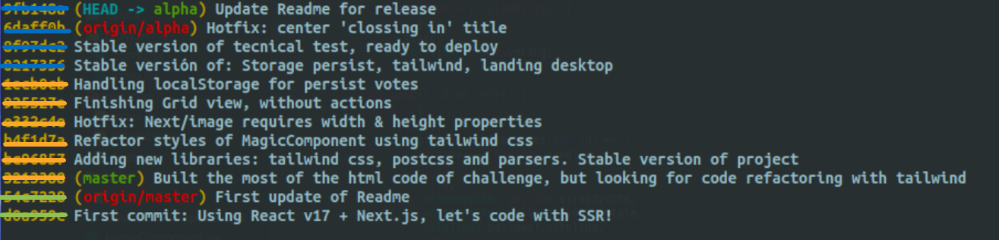

- **SEO Stragegy** Aprovechando el feature de indexación mejorada para las páginas web con Next.js se puede crear un Header para configurar SEO por cada ruta estática o dinámica en el proyecto.
  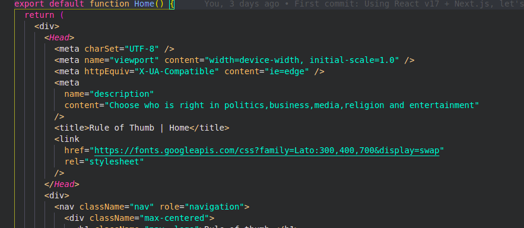

### Bloqueos y Observaciones

- Gestión de tiempo para desarrollar un sistema más modular
- El Método `handleRender` debió replantearse al saber el uso orientado a `render props` de la librería `swiper/react` para no trabajarlo en swith case, ya que no favorece a la _sugar syntax_
